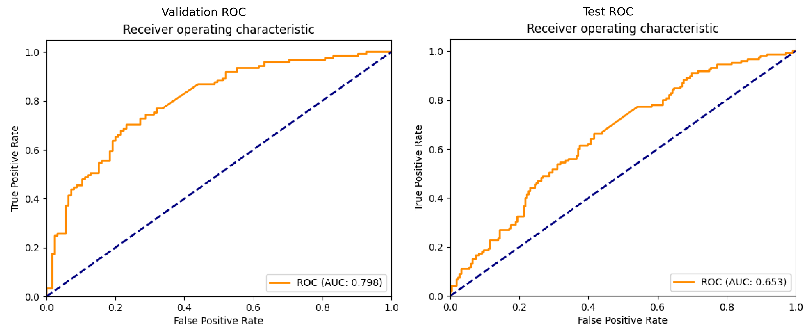
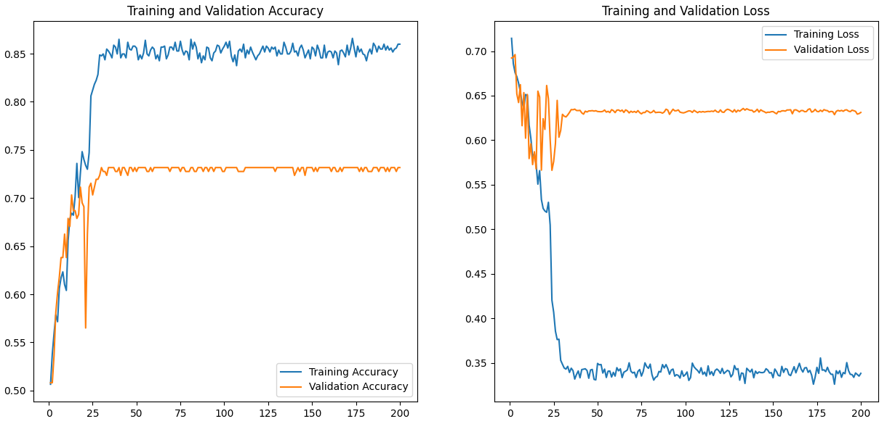
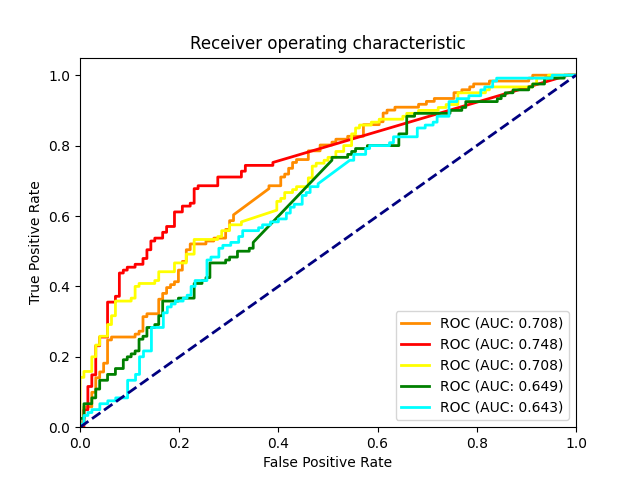
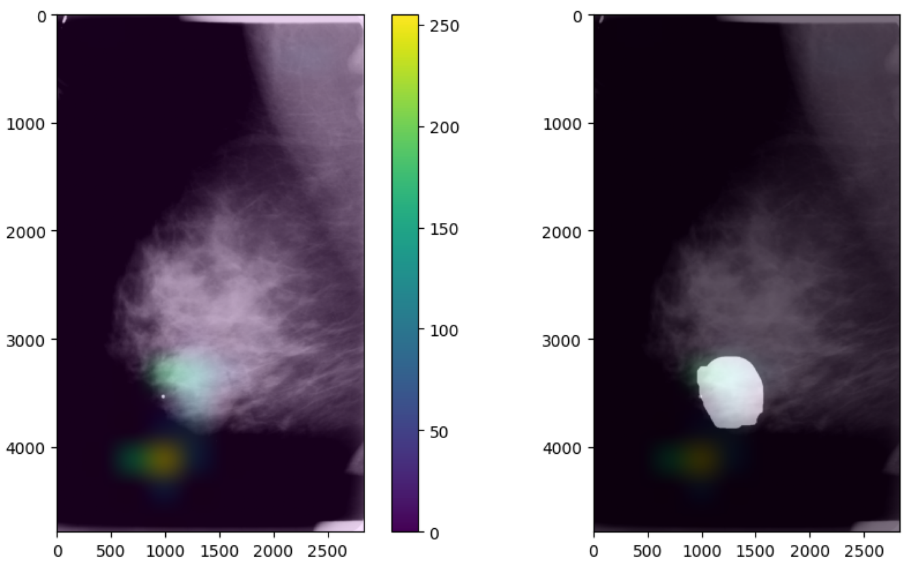
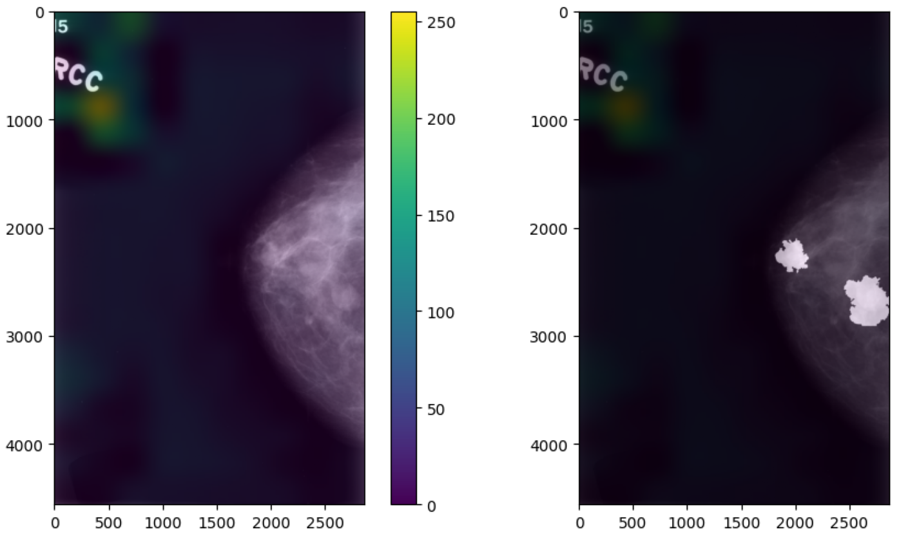

# Deep Learning-Based Prediction of Malignancy in Mammography

## Overview

This project explores the use of Convolutional Neural Networks (CNNs) for breast cancer detection from mammography images using publicly available medical datasets.

Early detection of breast cancer is critical for improving patient outcomes. This project aims to investigate deep learning techniques for automated classification while also providing interpretability through visualization methods.

## Dataset

The datasets used in this project are from the CBIS-DDSM collection available on The Cancer Imaging Archive.
Specifically:

- Mass-Training Full Mammogram Images (DICOM) → training & validation
- Mass-Test Full Mammogram Images (DICOM) → final testing
- Mass-Test ROI and Cropped Images (DICOM) → interpretability (Grad-CAM comparison with lesion regions)

Note: The dataset is not included in this repository due to its large size and usage restrictions.  
However, you can access and download the dataset directly from [The Cancer Imaging Archive - CBIS-DDSM](https://www.cancerimagingarchive.net/collection/cbis-ddsm/).

## Objective

- Binary classification of mammograms (benign vs malignant)
- Evaluate CNN performance using accuracy and ROC-AUC
- Provide model interpretability using Grad-CAM

## Methodology

### Model Development

Multiple Convolutional Neural Network (CNN) architectures were designed and implemented using:

- TensorFlow
- Keras

Different architectures were explored to identify the best-performing configuration.

### Training Strategy

To improve generalization and robustness, several techniques were applied:

- Hyperparameter tuning
  (learning rate, batch size, input size, layer number, filter number)
- Regularization
  Dropout layers were introduced to mitigate overfitting
- Data augmentation
  Applied to increase dataset variability and improve model robustness
 
 ### Evaluation Protocol

- Separate training, validation, and test sets were used.
- Model performance was evaluated using:
  - Accuracy
  - ROC-AUC

To further assess model reliability:

- Cross-validation was performed, but the training and validation performances varied considerably across the folds. This resulted in an unsteady degree of overfitting, which was influenced by the composition of the datasets used.

### Model Selection

Different models were systematically compared based on validation performance,
allowing the selection of the most effective architecture.  

## Results

The models show the ability to distinguish between benign and malignant cases, with performance evaluated through:

- Training and validation accuracy
- ROC curve analysis

### Performance Metrics

| Metric | Value |
|--------|-------|
| AUC (Validation Set) |	0.798 |
| AUC (Test Set) |	0.653 |

The observed performance gap between the validation and test sets indicates a **generalization issue**, suggesting that the model might be **overfitting** the training distribution. Specifically, the AUC being higher on the validation set compared to the test set is a typical sign of overfitting, where the model performs well on the data it was trained on but struggles to generalize to unseen data. These values are visualized in the following figures.

---

### Figure 1. ROC Curves on Validation and Test Sets

**Fig. 1:** Receiver Operating Characteristic (ROC) curves for validation and test sets. The decrease in performance on the test set highlights a degradation in model generalization, consistent with overfitting observed during training.

### Figure 2. Learning Curves on Training and Validation Sets

**Fig. 2:** Learning curves for training and validation sets. The discrepancy in accuracy and loss between the training and validation sets is an evident sign of overfitting. Specifically, there is a considerable gap between the training and validation accuracy as both sets reach their respective plateaus.

### Figure 3. ROC Curves - Cross-Validation

**Fig. 3:** The ROC curves from the cross-validation folds illustrate variability in model performance, with fluctuations depending on the data split. These fluctuations suggest potential issues with generalization, indicating that the model may be overfitting to certain subsets of the data.

## Key Insights

- A significant gap between validation and test performance indicates overfitting behavior.
- Model performance does not fully generalize to unseen data, suggesting a need for better regularization and data augmentation.
- The analysis emphasizes the importance of robust evaluation strategies in medical imaging tasks.
- Benchmarking multiple models was essential to identify performance limitations.

## Interpretability (Grad-CAM)

To improve model transparency, Grad-CAM was used to visualize which regions of the mammograms influenced the model's predictions.
Representative examples were selected from different prediction outcomes (True Positive, False Positive, True Negative, False Negative) 
to better understand model behavior.

Two representative cases are highlighted:

### Figure 3. Correct prediction with aligned attention

**Fig. 3:** In this case, the model focuses on the same region identified as pathological in the ground-truth lesion mask. This suggests that the model is learning clinically meaningful features with minor spatial discrepancies.

### Figure 4. Misaligned attention (failure case)

**Fig. 4:** Here, the model prediction is incorrect and the attention is not aligned with the lesion region. This highlights a limitation of the model and suggests that it may rely on spurious patterns with low spatial generalization and potential overfitting to non-clinical features.

### Findings

- A qualitative Grad-CAM analysis on a limited subset of test images shows that, in several cases, the model focuses on clinically relevant regions corresponding to annotated ROIs.
- However, in some failure cases, the model attention is partially misaligned with respect to the annotated regions, suggesting limitations in generalization and feature localization.

These observations highlight both the strengths and limitations of the model, providing useful insight into its reliability in medical imaging applications.

## Limitations

- Limited dataset size
- No significant class imbalance was observed in the test set; however, the training set distribution was not explicitly verified, which may still influence model behavior during training
- Use of full mammograms without advanced preprocessing
- No external validation dataset
- Models may not generalize well to real-world clinical settings without further validation

## Future Work

- Apply transfer learning techniques (e.g., ResNet, EfficientNet) to improve performance and generalization
- Explore more advanced preprocessing and data augmentation strategies
- Investigate segmentation-based approaches for lesion localization
- Improve model robustness and reduce overfitting through better regularization techniques
- Validate the model on external datasets to assess generalization in real-world scenarios
- Incorporate clinically relevant metrics such as sensitivity and recall
- Enhance interpretability by integrating more quantitative analysis methods alongside Grad-CAM

## How to Run

This project was developed and trained using Google Colab and Kaggle environments.

To explore the project locally:

pip install -r requirements.txt
jupyter notebook notebooks/model_development.ipynb

Alternatively, you can run the notebook directly on Google Colab or Kaggle.

## Repository Structure

- notebooks/ → exploratory analysis and model development
- src/ → reusable code for preprocessing, model architecture, and evaluation
- results/ → performance metrics and visual outputs (ROC curves, training curves, Grad-CAM)
- requirements.txt → dependencies required to run the project

## Technologies Used

- Python  
- TensorFlow / Keras – CNN model development and training  
- NumPy / Pandas – data preprocessing and manipulation  
- Matplotlib – visualization of training metrics and results

## About the Author

Master’s Degree in Physics – University of Pisa  
Focus on Machine Learning, Data Analysis, and Scientific Programming

## Key Takeaways

- Built and trained CNN models for medical image classification using real-world dataset
- Applied deep learning techniques including regularization and data augmentation to improve generalization
- Evaluated model performance using clinically relevant metrics such as ROC-AUC
- Investigated model interpretability using Grad-CAM, including both correct and failure cases
- Gained experience in handling medical imaging data and its specific challenges
